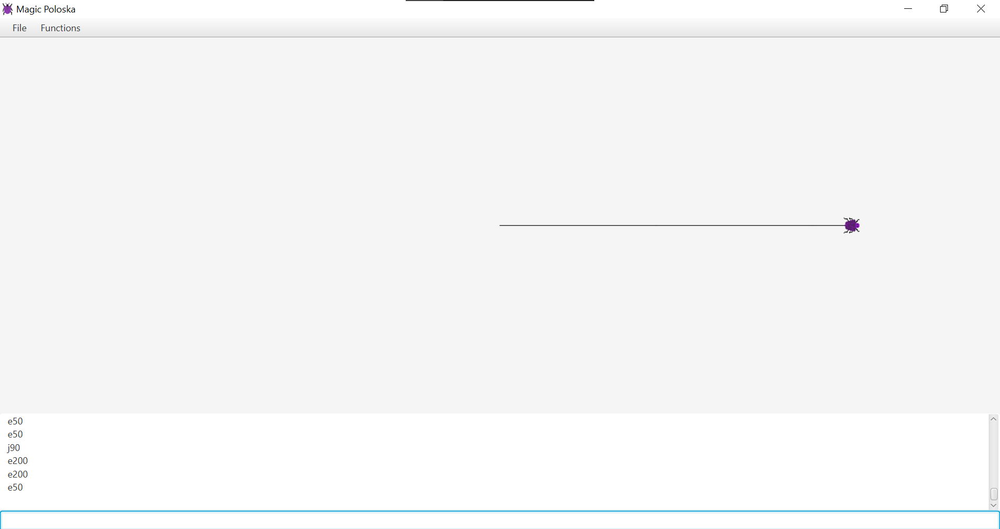
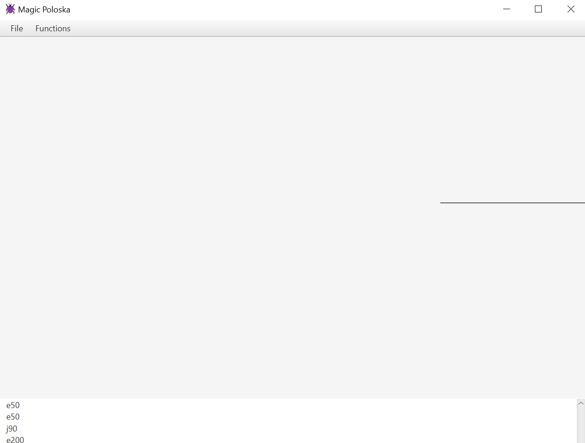
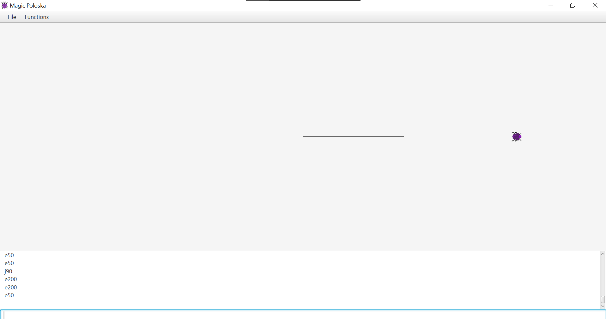
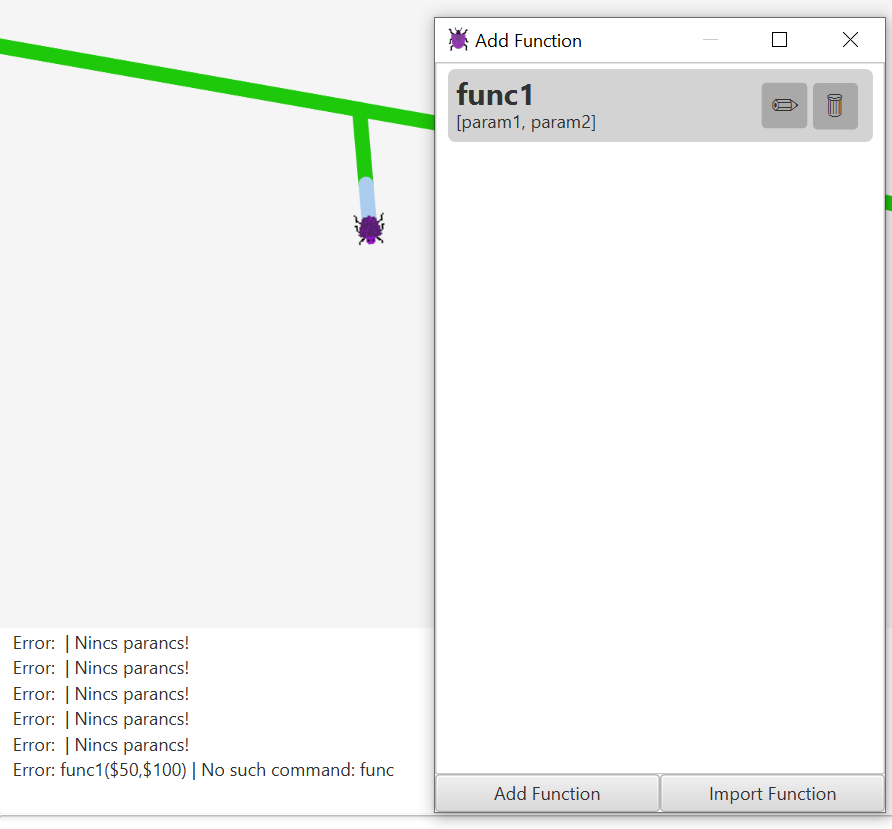
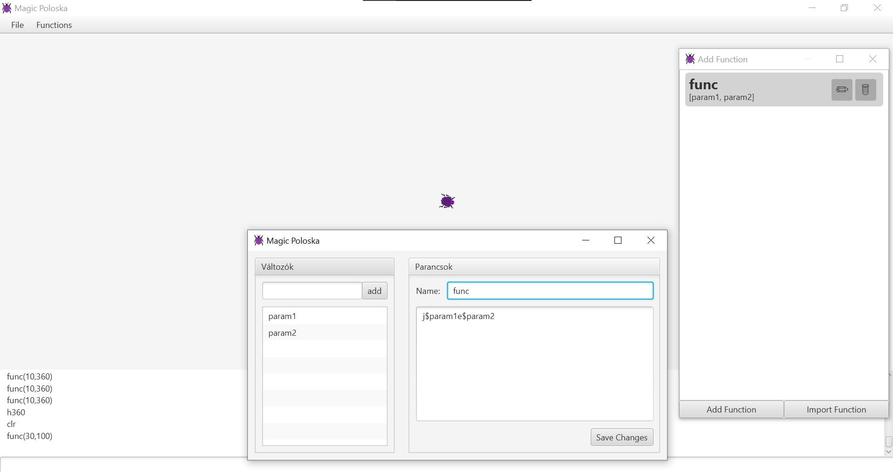

# Az alkalmazás hibáinak feltárása manuális teszteléssel

## Tesztelés menete:

- kezelőfelület
- egyszerű eljárások
- eljárás készítése
- több eljárás egybeágyaza
- eljárások exportálása, importálása
- loopok használata

## Hiba 1:

Az ablak átméretezésénél ugyan automatikusan változik a rajztábla mérete, viszont emiatt a már megrajzolt vonalak ha így az ablakon kívülre kerülnek akkor azok eltűnnek, így az ablak eredeti méretének visszaállítását követően nem látszanak.

## Hiba 2:

A program használatának egyik szabálya, hogy az eljárás neve csak betűket tartalmazhat, azonban lehetőség van olyan függvényt is megadni ami nem csak betűkből áll. Ezeket meghívni nem lehet.

## Hiba 3:

A dokumentációban található szabályok szerint különböző karaktersorozatok esetén nem szükséges szóközt tenni az utasítások közé. A func eljárás esetén azonban szóköz nélkül nem működik jól a program, csak az első utasítás hajtódik végre a második paraméterrel:

Szóközzel a két utasítás között megfelelően működik az eljárás.

## Hiba 4:

Eljárás importálásakor, ha sikertelen egy eljárás betöltése, a felhasználó nem kap visszajelzést erről. Sem a sikerességről/sikertelenségről sem a meghiúsult importálás okáról. Az ok lehet például: rossz formátum, már létező eljárás például más paraméterrel.